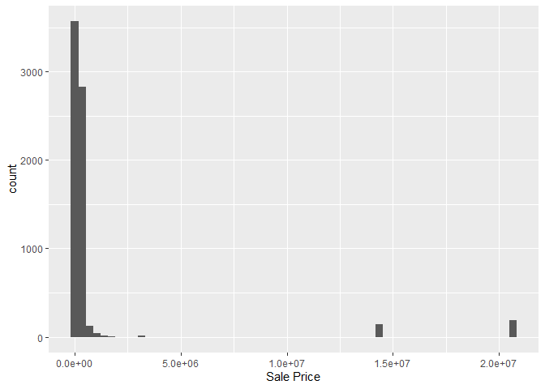
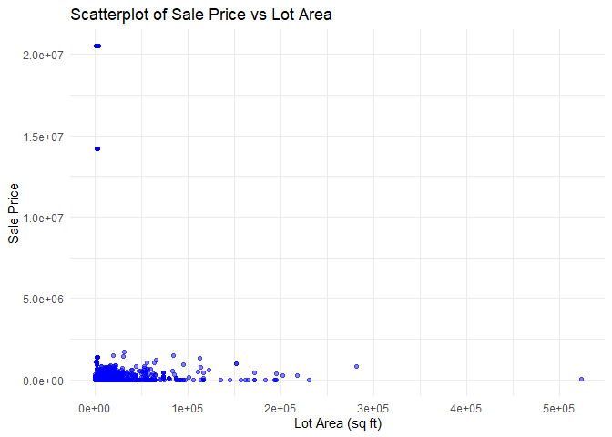

<!-- README.md is generated from README.Rmd. Please edit the README.Rmd file -->

# Lab report \#1

Follow the instructions posted at
<https://ds202-at-isu.github.io/labs.html> for the lab assignment. The
work is meant to be finished during the lab time, but you have time
until Monday evening to polish things.

Include your answers in this document (Rmd file). Make sure that it
knits properly (into the md file). Upload both the Rmd and the md file
to your repository.

All submissions to the github repo will be automatically uploaded for
grading once the due date is passed. Submit a link to your repository on
Canvas (only one submission per team) to signal to the instructors that
you are done with your submission.

## Step 1 Results

**What variables are there?**

Parcel ID, Address, Style, Occupancy, Sale Date, Sale Price, Multi-sale,
Year Built, Acres, Total Living Area (SF), Bedrooms, Finished BSMT (SQ),
Lot Area (SF), AC, Fireplace, Neighborhood

**What type are the variables?**

There is a mix of categorical (ex. Neighborhood, Occupancy, Style) and
numerical (ex. Total Living Area (SF), Bedrooms, Finished BSMT (SQ), Lot
Area (SF)). Some of the variables are continuous.

**What does each variable mean? What do we expect their data range to
be?**

Parcel ID: The house ID number in the system, it is a categorical
variable and there is no range.

Address: The address the house is located at, it is a categorical
variable and there is no range.

Style: The architectural style the house was built in, it is a
categorical variable, and the range is 12 (there are 12 different styles
the house can be classified as)

Occupancy: How many people live in the house, it is a categorical
variable, and the range is 5

Sale Date: The date the house was sold, it is a categorical variable,
and the range is any date between July 3rd, 2017 and August 31st, 2022.

Sale Price: The price the building was sold for, it is a numerical
variable, and the range is 0 - 22 million

Multi-sale: States if the house has been sold multiple times, it is a
numerical variable, and the range is 0 (no), 1 (yes).

Year Built: The year the building was built, it is a numerical variable,
and the range is 1880 to 2022 (where 0 is present as a missing value).

Acres: The total acres on the property, it is a numerical variable, and
the range is 0 to 12.

Total Living Area (SF): The total living area square footage, it is a
numerical variable, and the range is 0 to 6,007.

Bedrooms: The number of bedrooms in the property, it is a numerical
variable, and the range is 0 to 10.

Finished BSMT (SQ): The finished basement square footage, it is a
numerical variable, and the range is 10 to 6,496 (with NA for
non-finished basements).

Lot Area (SF): The square footage of the lot the house was built on, it
is a numerical variable, and the range is 0 to 523,228

AC: States whether the house has air conditioning, it is a numerical
variable, and the range is 0 (no), 1 (yes).

Fireplace: States whether the house has a fireplace, it is a numerical
variable, and the range is 0 (no), 1 (yes).

Neighborhood: What neighborhood the house is located in geographically,
it is a categorical variable and there is no range.

## Step 2 Results

The variable of interest is sales price of the houses.

## Step 3 Results

``` r
library(ggplot2)
ggplot(ames, aes(x = `Sale Price`)) + geom_histogram(binwidth = 350000)
```

<!-- -->

## Step 4 Results

Tirmidi’s work: \## Lot Area Impact

``` r
# Finding range of Lot Area
sum(is.na(ames$`LotArea(sf)`))
```

    ## [1] 89

``` r
colnames(ames) # Printing all column names
```

    ##  [1] "Parcel ID"             "Address"               "Style"                
    ##  [4] "Occupancy"             "Sale Date"             "Sale Price"           
    ##  [7] "Multi Sale"            "YearBuilt"             "Acres"                
    ## [10] "TotalLivingArea (sf)"  "Bedrooms"              "FinishedBsmtArea (sf)"
    ## [13] "LotArea(sf)"           "AC"                    "FirePlace"            
    ## [16] "Neighborhood"

``` r
# Scatterplot of Sale Price vs Lot Area
ggplot(ames, aes(x = `LotArea(sf)`, y = `Sale Price`)) +
  geom_point(alpha = 0.5, color = "blue") +
  theme_minimal() +
  labs(title = "Scatterplot of Sale Price vs Lot Area",
       x = "Lot Area (sq ft)",
       y = "Sale Price")
```

    ## Warning: Removed 89 rows containing missing values or values outside the scale range
    ## (`geom_point()`).

<!-- -->
